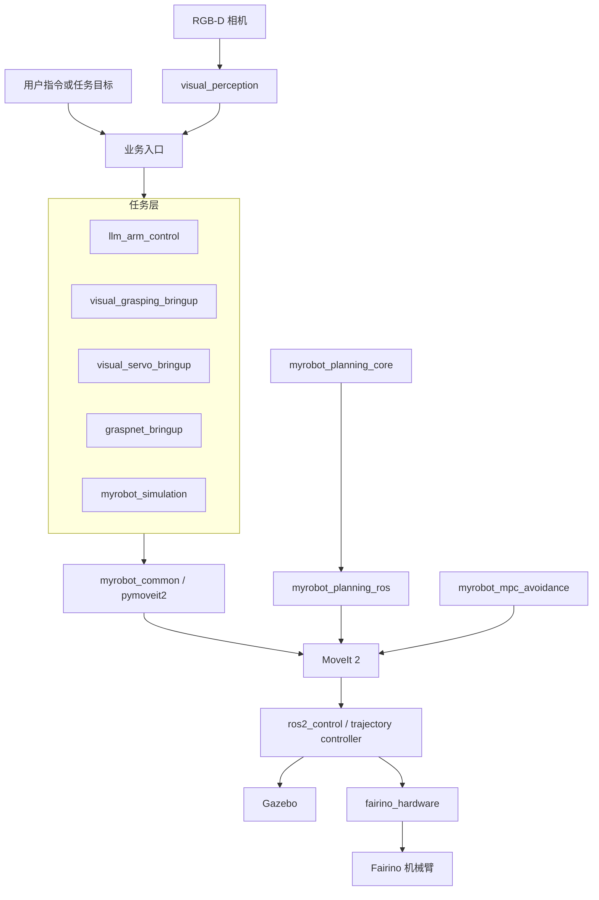

# Fairino ROS 2 技术文档中心

[返回项目首页](../../README.md)

这里是 Fairino 机械臂工作区的统一技术入口。第一次接触项目时，先按阅读路线建立整体认识，再进入具体功能；不要从某个节点文件反推整套系统。

> [!NOTE]
> 文档中的“静态检查”“测试通过”“Gazebo 验证”“云端连接”和“真实机械臂验证”是不同等级的证据。每篇专题只说明实际完成的验证，不自动外推到其他运行环境。

## 快速阅读路线

1. 阅读本页的架构与包职责。
2. 使用[仿真环境架构](simulation-and-planning/仿真环境架构说明.md)理解 Gazebo、MoveIt、控制器、相机和业务 Launch 的关系。
3. 按目标进入专题：
   - 规划与 IK：[规划 Demo](simulation-and-planning/planning-demo.md) → [规划器架构](simulation-and-planning/规划器架构说明.md) → [规划算法](simulation-and-planning/规划算法结构说明.md)
   - 感知与操作：[YOLO 视觉抓取](perception-and-grasping/yolov8-visual-grasping.md)或[GraspNet 抓取](perception-and-grasping/graspnet-simulation.md)
   - 闭环控制：[位置视觉伺服](simulation-and-planning/visual-servo-simulation.md)
   - 自然语言控制：[实时语音 LLM 控制](perception-and-grasping/llm-yolo-control.md)
   - 标定：[手眼标定](手眼标定/手眼标定文档说明.md)与[标定故障排查](手眼标定/标定程序问题排查.md)
   - 动态避障：[MPC/NMPC](simulation-and-planning/mpc动态避障.md)
4. 先完成静态配置和仿真检查，再进入真实相机或真实机械臂流程。

## 系统全貌



系统遵循三条边界：

- 视觉和 LLM 只提供目标语义或受限任务，不直接产生可绕过本地检查的关节命令；
- MoveIt、规划器、轨迹重定时和控制器负责运动可达性、碰撞与执行；
- 软件取消和状态机锁存不是安全等级急停，真实设备必须依赖独立硬件安全链路。

## 工作区目录与职责

### 机器人支持与硬件

| 包 | 职责 |
| --- | --- |
| [fairino_msgs](../myrobot_support_ws/fairino_msgs/) | Fairino 自定义 Message/Service 接口 |
| [fairino_hardware](../myrobot_support_ws/fairino_hardware/) | ros2_control 硬件插件和字符串命令服务 |
| [fairino_description](../myrobot_support_ws/fairino_description/) | Fairino3/Fairino5 URDF、xacro 与 mesh |
| [fairino_arm_moveit_descriptions](../myrobot_support_ws/fairino_arm_moveit_descriptions/) | 带夹爪和相机的机器人描述 |
| [fairino3_v6_moveit2_config](../myrobot_support_ws/fairino3_v6_moveit2_config/) | Fairino3_v6 MoveIt 配置 |
| [fairino_arm_moveit_config](../myrobot_support_ws/fairino_arm_moveit_config/) | 当前抓取、伺服和 LLM 主链使用的 MoveIt 配置 |

### 规划与公共执行

| 包 | 职责 |
| --- | --- |
| [myrobot_planning_core](../myrobot_planning_core/) | ROS 无关的采样规划、解析 IK、碰撞与轨迹后处理 |
| [myrobot_planning_ros](../myrobot_planning_ros/) | MoveIt PlannerManager、IK 插件与独立规划接口 |
| [myrobot_common](../myrobot_common_ws/myrobot_common/) | MoveItMotion、目标缓存、TF、位姿、安全取消等公共能力 |
| [pymoveit2](../myrobot_common_ws/pymoveit2/) | Python MoveIt 2 Action/Service 客户端 |
| [trajectory_retime_server](../myrobot_common_ws/trajectory_retime_server/) | 基于 MoveIt TOTG 的轨迹重新参数化 |
| [myrobot_mpc_avoidance](../myrobot_mpc_ws/myrobot_mpc_avoidance/) | acados MPC/NMPC 动态避障、轨迹跟踪和重规划通知 |

### 感知、抓取与伺服

| 包 | 职责 |
| --- | --- |
| [visual_perception](../visual_perception/) | YOLO/YOLO-OBB、RGB-D 三维估计、跟踪与语义点云过滤 |
| [visual_grasping_bringup](../visual_grasping_bringup/) | 离散 YOLO 抓放状态机与实机入口 |
| [visual_servo_bringup](../visual_servo_bringup/) | 图像伺服、位置伺服及 PID/MPC/LADRC/NLADRC 控制器 |
| [graspnet_bringup](../graspnet_ws/graspnet_bringup/) | GraspNet 推理服务、抓取候选和执行状态机 |
| [graspnet_source](../graspnet_ws/graspnet_source/) | GraspNet 上游源码与非商业许可边界 |

### LLM、仿真与标定

| 包 | 职责 |
| --- | --- |
| [llm_arm_control](../llm_arm_control/) | 本地 KWS、Qwen Realtime、工具协议、Preview 与安全执行 |
| [myrobot_simulation](../myrobot_simulation/) | Gazebo、MoveIt、控制器、相机、场景和业务 Launch 编排 |
| [realsense2_gz_description](../camera_ws/realsense2_gz_description/) | RealSense D435 Gazebo 描述与硬件相机 profile |
| [hand_eye_calibration](../calibration_ws/hand_eye_calibration/) | 自动/半自动手眼标定、结果评估和 TF 发布 |

`camera_ws` 和 `calibration_ws` 还包含 RealSense、DepthAI、Easy Handeye2 与 ros2_aruco 等上游代码。阅读或修改这些目录前，应先确认对应上游许可证和本地改动边界。

## 主要运行入口

| 目的 | 命令 |
| --- | --- |
| 基础 Gazebo/MoveIt | `ros2 launch myrobot_simulation gazebo.launch.py` |
| 规划与 IK 对比 | `ros2 launch myrobot_simulation motion_planning_demo_sim.launch.py` |
| YOLO 视觉抓取仿真 | `ros2 launch myrobot_simulation visual_grasping_sim.launch.py` |
| GraspNet 抓取仿真 | `ros2 launch myrobot_simulation graspnet_grasping_sim.launch.py` |
| 位置视觉伺服仿真 | `ros2 launch myrobot_simulation visual_position_servo_sim.launch.py` |
| MPC 动态避障仿真 | `ros2 launch myrobot_simulation mpc_avoidance_demo_sim.launch.py` |
| LLM 实时语音控制仿真 | `ros2 launch myrobot_simulation llm_robot_control_sim.launch.py` |
| 自动手眼标定仿真 | `ros2 launch myrobot_simulation calibration_sim.launch.py` |
| LLM 真实机械臂入口 | `ros2 launch llm_arm_control llm_robot_control.launch.py` |
| YOLO 真实机械臂抓取 | `ros2 launch visual_grasping_bringup visual_grasping.launch.py` |

运行前统一执行：

```bash
source /opt/ros/humble/setup.bash
source install/setup.bash
```

命令能够解析只证明 Launch 接口和安装树可见；视觉模型、云端凭据、相机、控制器与机械臂仍需各自检查。

## 专题文档

### 仿真与规划

- [仿真环境架构](simulation-and-planning/仿真环境架构说明.md)
- [规划 Demo 与基准测试](simulation-and-planning/planning-demo.md)
- [规划器 ROS/MoveIt 架构](simulation-and-planning/规划器架构说明.md)
- [自定义 RRT 规划算法](simulation-and-planning/规划算法结构说明.md)
- [位置视觉伺服](simulation-and-planning/visual-servo-simulation.md)
- [MPC 动态避障](simulation-and-planning/mpc动态避障.md)
- [相机模型渲染排查](simulation-and-planning/相机模型渲染问题解决.md)

### 感知、抓取与智能控制

- [YOLO RGB-D 视觉抓取](perception-and-grasping/yolov8-visual-grasping.md)
- [GraspNet 抓取仿真](perception-and-grasping/graspnet-simulation.md)
- [实时语音、YOLO 与 MoveIt 智能体](perception-and-grasping/llm-yolo-control.md)

### 标定

- [手眼标定操作说明](手眼标定/手眼标定文档说明.md)
- [ROS Python 标定节点段错误排查](手眼标定/标定程序问题排查.md)

## 证据与维护约定

- 文档中的包名、文件名、Topic、Service、Action、Launch 参数和默认值应以当前源码为准。
- 已删除实现只在解释兼容边界时出现，不能继续作为操作入口。
- 命令示例使用仓库相对路径、`$HOME` 或当前工作区，不记录个人绝对路径。
- 新增功能时同时更新根 README、本文档入口和对应专题；不要复制一份会独立漂移的数据流说明。
- 仿真通过不能代替实机安全验收；真实机械臂结果必须明确标注硬件、环境和安全条件。
