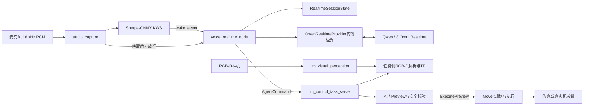
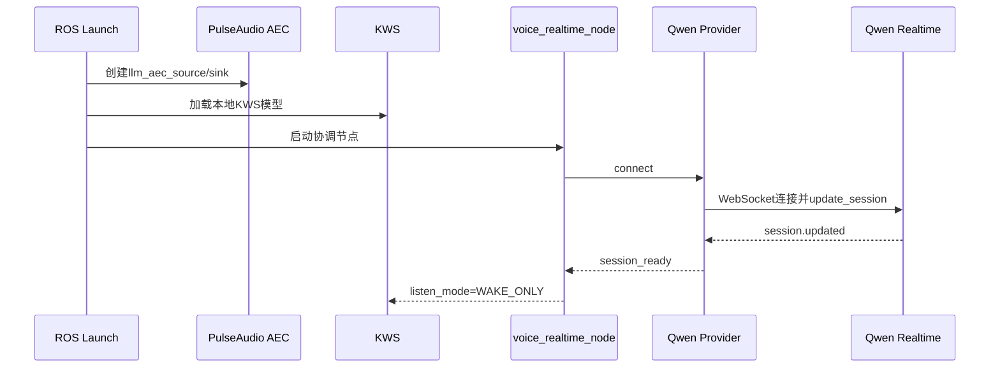
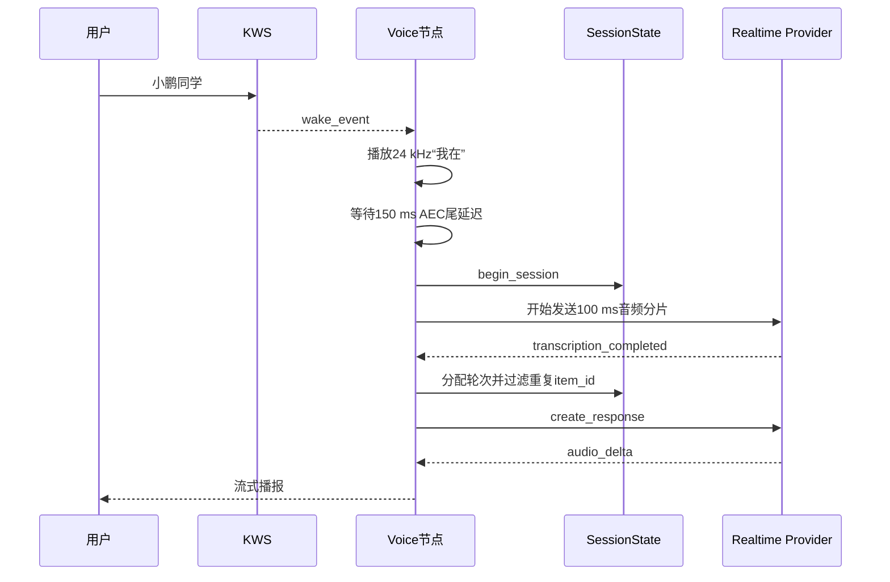
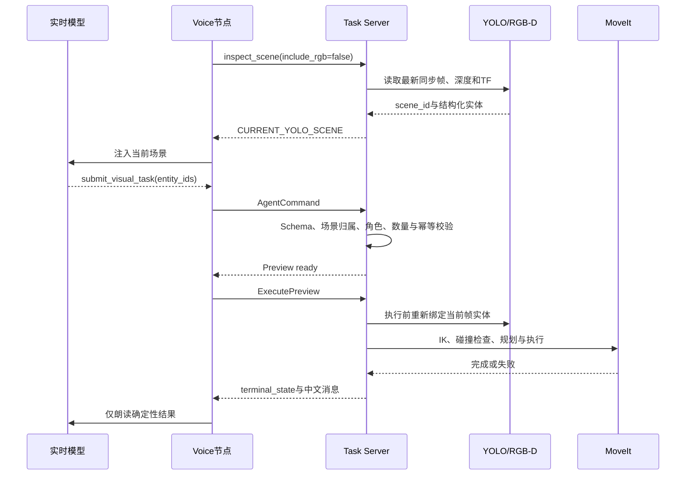

# 实时语音、YOLO RGB-D 与 MoveIt 机械臂智能体

[返回技术文档中心](../README.md)

本文面向第一次接触本项目的开发者，解释系统为什么这样设计、数据如何流动、如何完成本地配置，以及怎样安全地启动仿真或实机。

## 1. 系统解决什么问题

用户可以先说唤醒词，再用自然语言发出命令，例如：

> 小鹏同学，把桌面上的三个螺栓从左到右放进盒子。

系统会依次完成：

1. 本地KWS检测唤醒词；
2. 将唤醒后的麦克风音频发送给实时语音模型；
3. 模型理解语言并从当前YOLO场景中选择实体ID；
4. 本地任务服务器验证模型参数并创建Preview；
5. 执行前重新读取RGB-D、TF和当前检测结果；
6. MoveIt完成IK、碰撞检查、规划和执行；
7. 实时语音模型播报结果。

大模型不是运动控制器。它不能生成关节轨迹、绝对抓取位姿、安全复位或急停指令。它只负责理解自然语言、选择结构化场景中的实体，并调用经过限制的工具。

键盘控制仍然保留：

- `Space`：停止；
- `h`：复位；
- `r`：只解除软件锁存。

这些键盘功能也不是安全等级急停。真实生产设备必须使用硬件急停、安全继电器或驱动器STO。

## 2. 总体架构



各模块只负责一件核心工作：

| 模块 | 主要职责 | 不负责 |
|---|---|---|
| `voice_wake_node` | 本地唤醒词检测 | 命令理解、机械臂动作 |
| `QwenRealtimeProvider` | Qwen连接、音频和事件格式转换 | 任务安全、视觉坐标 |
| `RealtimeSessionState` | 轮次、单飞回答、取消、重连和超时 | ROS、网络和音频播放 |
| `voice_realtime_node` | ROS协调、播音、工具桥接 | Qwen原始协议细节 |
| `agent_protocol` | 工具Schema、系统提示词和模型参数校验 | Preview和运动执行 |
| `llm_visual_perception` | 持续YOLO推理和诊断发布 | 最终执行位姿许可 |
| 任务侧RGB-D解析 | 深度、TF、候选位姿和当前帧安全解析 | 自然语言理解 |
| `task_logic` | 任务数据、计划、安全状态、Preview生命周期和确定性反馈 | 模型协议 |
| `llm_control_task_server` | 场景、Preview、幂等和执行权限 | 云模型连接 |
| MoveIt | IK、碰撞检查、规划和轨迹执行 | 目标语义选择 |

## 3. 两种本地模型与云端模型

### 3.1 KWS是什么

KWS是Keyword Spotting，即关键词检测。它一直在本机监听低成本的音频流，只判断是否出现了“小鹏同学”“小鹏小鹏”或“Hi Robot”。

模型随`llm_arm_control`包安装，源码目录为：

```text
src/llm_arm_control/model/kws/
├── encoder.onnx
├── decoder.onnx
├── joiner.onnx
├── tokens.txt
├── keywords.txt
├── keywords_raw.txt
└── en.phone
```

构建安装后对应`share/llm_arm_control/model/kws`。源码模型目录中都是普通文件，
不存在外层`kws`链接、版本目录或ONNX短名链接；使用`--symlink-install`时，
安装树可以由colcon链接回这些源码普通文件。Launch不提供模型路径覆盖，
因此源码运行与安装后运行解析同一份包资源。

运行时使用的主要文件：

| 文件 | 初学者理解 |
|---|---|
| `encoder.onnx` | 从连续音频中提取语音特征 |
| `decoder.onnx` | 根据已有识别状态计算下一步表示 |
| `joiner.onnx` | 合并编码器与解码器结果，得到token概率 |
| `tokens.txt` | token编号与符号的对应表 |
| `en.phone` | 英文关键词生成所需的音素词典 |
| `keywords_raw.txt` | 人可读的唤醒词定义 |
| `keywords.txt` | Sherpa-ONNX实际加载的token化关键词 |

KWS不负责理解“把螺栓放入盒子”。它只负责打开一次语音会话。这样可以保证未唤醒时不会持续上传麦克风音频。

模型来自Sherpa-ONNX的中英文KWS模型。模型结构和关键词生成方式可参考[官方KWS说明](https://k2-fsa.github.io/sherpa/onnx/kws/index.html)。仓库锁文件中的`license_status`仍标记为模型专用许可证未公开，部署到产品前应单独完成许可证核验。

### 3.2 Qwen Realtime是什么

当前云端实现为：

```yaml
realtime_provider: qwen
model: qwen3.8-omni-flash-realtime
voice: Tina
```

它同时承担：

- 16 kHz单声道S16LE语音输入；
- 输入语音转写；
- 自然语言理解和连续对话；
- Function Calling；
- 24 kHz单声道S16LE流式语音输出。

系统使用`semantic_vad`，默认尾静音为700 ms。服务端自动创建回答和自动打断均关闭，回答的创建、取消和排队由本地状态机控制。Qwen的官方Python SDK、音频格式和Realtime会话参数见[Qwen Omni Realtime Python SDK文档](https://www.alibabacloud.com/help/en/model-studio/omni-realtime-python-sdk)。

Function Calling只能说明模型可以尝试生成工具名和参数，不能证明参数一定符合Schema。Realtime和多模态模型也不能依赖严格结构化输出。因此本项目始终在本地重新解析和校验，相关限制见[Function Calling文档](https://help.aliyun.com/zh/model-studio/qwen-function-calling)和[结构化输出文档](https://help.aliyun.com/zh/model-studio/qwen-structured-output)。

### 3.3 为什么Qwen协议要有独立传输边界

`voice_realtime_node`不再直接处理DashScope事件名。内部统一接口包含：

```text
connect
send_audio
create_response
cancel_response
send_tool_result
send_image
close
```

Qwen原始事件会先转换成统一事件，例如：

```text
session.updated                              → session_ready
input_audio_buffer.speech_started            → speech_started
conversation...transcription.completed       → transcription_completed
response.audio.delta                         → audio_delta
response.function_call_arguments.done        → tool_call
response.done                                → response_done
```

这样，DashScope SDK细节不会进入ROS协调、YOLO、Preview或MoveIt层。当前只有一个Qwen实现，因此没有额外的单实现Provider接口或插件框架；未知`realtime_provider`仍会直接启动失败，不会偷偷回退。

## 4. 三条关键数据流

### 4.1 启动和连接



Qwen连接在启动阶段预建立，但在KWS成功前，音频上传字节数必须为零。PulseAudio WebRTC AEC初始化失败时语音链直接失败，不静默退化成可能产生扬声器回声的输入。

### 4.2 唤醒、语音和回答



同一时刻只允许一个回答。用户在播报期间再次讲话时：

1. 本地立即停止扬声器；
2. 标记旧回答取消；
3. 如果已有`response_id`，立即向服务端发送取消；
4. 如果尚无`response_id`，等`response_started`后再取消；
5. 只保留最新一轮待回答请求；
6. 迟到的旧音频和工具调用被丢弃。

连接临时中断时，不会重放未完成的机器人命令。连接恢复后会提示“连接已恢复，请重新说刚才的指令”。

### 4.3 从语言到机械臂动作



模型收到的是实体ID和结构化属性，不是可直接执行的坐标。执行层重新检查深度、TF、工作空间、IK和碰撞状态。

批量抓放时，每次抓放前必须重新检测剩余来源和盒子，并分别在连续两张新鲜帧中稳定。盒子连续5秒不可见时，仅终止当前批次，不进入全局故障锁存，也不读取历史盒位姿。

## 5. 工具和本地安全边界

实时模型可调用：

| 工具 | 作用 |
|---|---|
| `inspect_scene` | 获取结构化场景，必要时请求一帧RGB |
| `submit_visual_task` | 提交当前场景中的来源和目的地实体ID |
| `move_relative` | 按`base_link`固定轴提交有限幅度相对移动 |
| `set_gripper` | 打开或闭合夹爪 |
| `ask_user` | 询问真正缺失的信息 |
| `cancel_task` | 取消尚未完成的任务 |

模型不能调用停止、复位、解锁或home工具。

`AgentCommand.srv`使用`call_id`作为幂等键。同一Function Call重复到达时只返回第一次结果，不创建第二个Preview。执行动作必须经过`ExecutePreview.action`，模型不能绕过Preview直接驱动MoveIt。

`submit_visual_task`只接受当前`scene_id`中的实体。单个合法字符串ID可以被规范化为单元素数组；未知ID、逗号串、对象、重复ID、旧场景和超过10个目标会被拒绝。JSON或Schema失败只允许模型修复一次，第二次仍失败时零执行。

## 6. `setup_voice_runtime.sh`到底做什么

脚本路径：

```text
src/llm_arm_control/scripts/setup_voice_runtime.sh
```

它是安装和检查工具，不是ROS节点，也不会发送机械臂运动指令。

### 6.1 无参数运行

```bash
./src/llm_arm_control/scripts/setup_voice_runtime.sh
```

用于第一次配置，或者Python依赖、KWS模型损坏/缺失后的恢复：

1. 安装锁定版本的Sherpa-ONNX、关键词处理依赖和DashScope SDK；
2. 读取`voice_models.lock.yaml`；
3. 包内KWS文件缺失时下载到临时目录；
4. 校验归档大小和SHA256；
5. 从上游版本目录提取并重命名为扁平的运行时文件；
6. 生成关键词文件，并拒绝符号链接形式的托管资产；
7. 退出时删除临时下载归档。

模型已经存在时不会重复下载。

### 6.2 `--check-only`

```bash
./src/llm_arm_control/scripts/setup_voice_runtime.sh --check-only
```

用于启动前或故障排查。它不安装、不下载、不联网，只验证：

- Python依赖版本；
- `aplay`和`pactl`；
- PulseAudio AEC模块；
- 包内KWS目录、普通文件和运行时文件完整性。

它不要求DashScope密钥，因为没有建立云连接。

### 6.3 `--check-cloud`

```bash
./src/llm_arm_control/scripts/setup_voice_runtime.sh --check-cloud
```

它先完成`--check-only`，再检查：

- `DASHSCOPE_API_KEY`；
- `DASHSCOPE_WORKSPACE_ID`；
- Qwen Realtime身份验证和一次WebSocket连接。

连接成功后立即关闭。它不启动ROS、Gazebo、MoveIt或机械臂。当前只有Qwen适配器，因此该选项明确检查Qwen。

### 6.4 其他选项

```bash
# 首次安装系统音频依赖，可与无参数安装组合
./src/llm_arm_control/scripts/setup_voice_runtime.sh --install-system-deps

# 修改关键词定义后重新生成keywords.txt
./src/llm_arm_control/scripts/setup_voice_runtime.sh --refresh-keywords

```

脚本不接受模型目录覆盖；它自动识别源码包或安装后的package share。通常只在首次部署、依赖升级、模型缺失或语音链故障时运行，不需要在每次`ros2 launch`前重复运行。

仓库仅对`src/llm_arm_control/model/**/*.onnx`和
`src/visual_perception/models/*.{pt,onnx}`开放Git跟踪；TensorRT
`.engine`、`.blob`及其他训练资产仍被忽略。KWS归档来源、大小和SHA256记录在
`config/voice_models.lock.yaml`。其中许可证状态仍为
`model_specific_license_not_published`，提交或再分发模型前必须由项目方单独完成许可证审查。

## 7. 从零完成本地配置

### 7.1 检查音频设备

```bash
arecord -l
pactl get-default-source
pactl get-default-sink
```

仿真和实机默认都使用`audio_input_device:=auto`。启动时系统优先选择有效的默认物理采集源，并排除monitor、HDMI输出监听源和项目自己的`llm_aec_source`。如果只有一个物理麦克风会自动选择它；如果存在多个候选且默认源无效，Launch会列出候选并停止，避免录错设备。

也可以用精确PulseAudio source名称或ALSA地址覆盖：

```bash
# 精确PulseAudio名称
audio_input_device:=alsa_input.pci-0000_00_1f.3.analog-stereo

# 精确ALSA采集卡和设备
audio_input_device:=plughw:0,0
```

显式设备不存在时会直接报错，不再静默切换到默认麦克风。`audio_input_volume_percent`默认是`100`，范围为1到100；语音链启动前会解除静音、设置输入音量并重新读取确认。这个动作只改变所选采集源，不改变KWS阈值。

### 7.2 安装运行时和模型

```bash
cd ${HOME}/my-workspace/fairino_robotarm
./src/llm_arm_control/scripts/setup_voice_runtime.sh --install-system-deps
./src/llm_arm_control/scripts/setup_voice_runtime.sh --check-only
```

`sudo apt-get`只出现在`--install-system-deps`路径。普通检查不需要管理员权限。

### 7.3 配置Qwen凭据

密钥和业务空间ID只通过环境变量提供，不写入YAML、Git或日志：

```bash
read -rsp "DashScope API Key: " DASHSCOPE_API_KEY && echo
read -rp "DashScope Workspace ID: " DASHSCOPE_WORKSPACE_ID
export DASHSCOPE_API_KEY DASHSCOPE_WORKSPACE_ID
```

当前使用华北2北京业务空间专属WebSocket域名。业务空间ID只允许字母、数字、下划线和连字符。

验证云连接：

```bash
./src/llm_arm_control/scripts/setup_voice_runtime.sh --check-cloud
```

### 7.4 构建

```bash
source /opt/ros/humble/setup.bash
colcon build --packages-select llm_arm_control visual_perception myrobot_simulation
source install/setup.bash
```

重新打开终端后，需要再次source ROS和工作区；环境变量也必须在启动ROS的同一环境中存在。

### 7.5 检查配置

主要配置文件：

```text
src/llm_arm_control/config/llm_robot_control_params.yaml
```

常用参数：

```yaml
voice_realtime_node:
  ros__parameters:
    realtime_provider: qwen
    model: qwen3.8-omni-flash-realtime
    voice: Tina
    vad_silence_ms: 700
    audio_chunk_ms: 100
    idle_timeout_sec: 30.0
```

不要为了接入另一个模型而修改任务服务器、YOLO或MoveIt协议。应该新增Provider适配器并把原始事件转换为统一事件。

## 8. 正常启动

### 8.1 先查看Launch参数

```bash
source /opt/ros/humble/setup.bash
source install/setup.bash

ros2 launch myrobot_simulation llm_robot_control_sim.launch.py --show-args
ros2 launch llm_arm_control llm_robot_control.launch.py --show-args
```

### 8.2 Gazebo仿真

```bash
ros2 launch myrobot_simulation llm_robot_control_sim.launch.py
```

指定麦克风：

```bash
ros2 launch myrobot_simulation llm_robot_control_sim.launch.py \
  audio_input_device:=plughw:0,0 \
  audio_input_volume_percent:=100
```

### 8.3 真实机械臂

确认硬件急停、控制器、相机、手眼标定、工作空间和MoveIt配置均已独立验证后再启动：

```bash
ros2 launch llm_arm_control llm_robot_control.launch.py
```

仿真与实机共用语音Provider、工具协议和本地校验。差异主要位于相机来源、机器人驱动、MoveIt控制器和标定TF。

## 9. 一条抓放命令的完整例子

用户说：

> 小鹏同学，把最左边的螺栓放进盒子。

可能的数据变化如下：

```text
麦克风PCM
→ KWS命中“小鹏同学”
→ 播放“我在”
→ Qwen转写命令
→ 本地inspect_scene生成scene-42
→ Qwen选择bolt-2与box-1
→ submit_visual_task(
     operation="pick_place",
     scene_id="scene-42",
     source_entity_ids=["bolt-2"],
     destination_entity_id="box-1"
   )
→ 本地Schema和场景归属校验
→ 创建Preview
→ ExecutePreview
→ 当前帧重新检测bolt和box
→ 深度、TF、IK、碰撞和MoveIt规划
→ 机械臂执行
→ 播报完成或具体错误
```

如果模型自造`bolt-99`，任务服务器会拒绝。如果盒子在执行前消失，系统不会使用旧盒位姿，而是终止当前批次并允许下一项新任务。

## 10. 诊断方法

```bash
ros2 service call /llm_control/status std_srvs/srv/Trigger '{}'
ros2 topic echo /voice_control/listen_mode
ros2 topic hz /voice_control/audio
ros2 topic hz /yolo/detected_result

# 临时查看更详细的KWS音频健康诊断
ros2 param set /voice_wake_node voice_diagnostics_enabled true
```

关键日志：

默认`INFO`会显示音频路由、首个健康窗口、唤醒命中和输入转写；其他完整结构化追踪默认位于`DEBUG`。音频、视觉同步和取消等可恢复问题使用`WARN`，连接、模型、执行和超时失败使用`ERROR`。

| 日志 | 用途 |
|---|---|
| `VOICE_AUDIO_ROUTE` | 实际选择的物理麦克风、ALSA映射、音量、静音状态和AEC绑定；不含凭据 |
| `VOICE_AUDIO_HEALTH` | 首个5秒窗口必定输出一次；显示发布者、格式、帧数、RMS、峰值和静音比例 |
| `VOICE_AUDIO_UNHEALTHY` | 区分无发布者、无音频信息、格式错误、无帧、数字静音和持续低电平 |
| `WAKE_TRACE` | 本地KWS实际命中的规范化唤醒词 |
| `QWEN_INPUT` | 云端输入转写 |
| `QWEN_OUTPUT`（DEBUG） | 云端输出转写 |
| `QWEN_AUDIO_TRACE`（DEBUG） | 语音轮次、取消、排队和重复过滤 |
| `QWEN_RESPONSE_TRACE`（DEBUG） | 回答完成、取消或截断原因 |
| `QWEN_TOOL_TRACE`（DEBUG） | 工具名、字段、修复次数和Preview结果，不记录原始敏感参数 |
| `QWEN_CONNECTION_ERROR` | 云连接错误、关闭码和连接代次 |
| `SCENE_TRACE`（DEBUG） | 场景ID、实体角色和不可用原因 |
| `VISION_SYNC` | RGB、Depth、同步和推理频率 |
| `BATCH_TRACE`（DEBUG） | 来源与目的地稳定状态、盒子数量和失败阶段 |

常见判断：

- 没有`WAKE_TRACE`：先看`VOICE_AUDIO_ROUTE`是否选中真实麦克风，再看`VOICE_AUDIO_HEALTH`的帧数、RMS和峰值；只有路由和输入电平正常后才检查KWS文件和阈值；
- 有唤醒但没有`QWEN_INPUT`：检查凭据、WebSocket和AEC后的音频话题；
- 工具被拒绝：查看`QWEN_TOOL_TRACE`和任务服务器错误码；
- 有实体但不能执行：检查深度、TF、工作空间、IK和碰撞状态；
- 盒子中途消失：这是实时视觉失败，不是来源目标“不稳定”。

## 11. 验证结果应该怎样表述

不同验证层次不能混为一谈：

- `py_compile`和单元测试：证明Python语法和模拟事件行为；
- `colcon build`：证明ROS包可以构建；
- `--check-only`：证明本地语音依赖和KWS文件存在；
- `--check-cloud`：证明一次Qwen认证和WebSocket连接；
- Gazebo语音抓放：证明仿真端到端链路；
- 真机抓放：证明特定硬件、环境和安全条件下的实际结果。

单元测试通过不能证明麦克风唤醒率、扬声器AEC效果、云端长期稳定性、YOLO召回率或真实机械臂安全验收已经完成。

## 12. 架构维护边界

- Qwen SDK和原始协议由`QwenRealtimeProvider`负责；
- 单飞回答、取消、重连和轮次由`RealtimeSessionState`负责；
- 工具Schema、系统提示词、参数解析和修复提示由`agent_protocol.py`负责；
- `task_logic.py`只维护任务领域模型、安全状态、Preview生命周期和确定性反馈；
- `voice_logic.py`是无ROS依赖的唤醒词纯函数，由唤醒节点、实时语音节点和测试共享。

当前规范唤醒词只有“小鹏同学”“小鹏小鹏”“Hi Robot”，匹配时忽略大小写、空格和标点。新增模型Provider、音频队列或工具缓存前，应先用运行日志证明现有边界不能满足需求；不能为了扩展性让模型协议、ROS协调和运动安全重新耦合。
