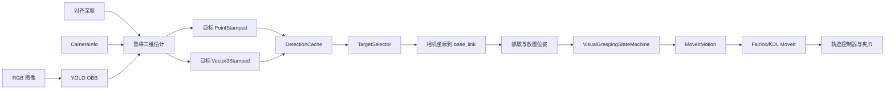
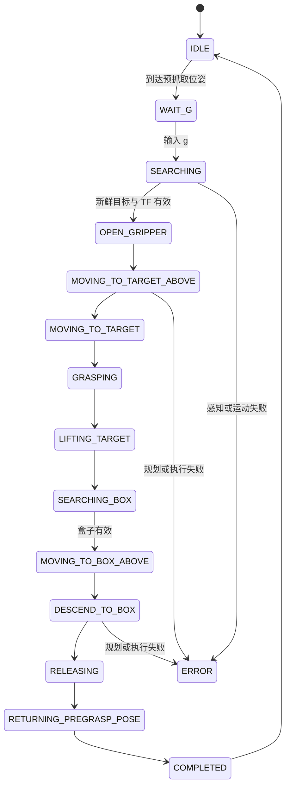

# YOLO RGB-D 视觉抓取

[返回技术文档中心](../README.md)

本文说明当前 `visual_grasping_bringup` 的职责、数据流、启动方式和安全边界。它使用 YOLO-OBB 与深度图得到目标三维位置和主轴，再由本地状态机通过 MoveIt 完成一次“抓取目标并放入盒子”的离散任务。

## 功能定位

系统负责：

- 启动或接入 RGB-D 相机；
- 运行 `yolo_detector_obb.py`；
- 选择新鲜的 `elongated_object`、`cube` 或 `stone`；
- 将相机坐标中的位置和主轴转换到 `base_link`；
- 生成目标上方、抓取、抬升、盒子上方和放置位姿；
- 通过 Fairino/KDL MoveIt client、轨迹重定时和夹爪执行状态机；
- 接收停止、复位、恢复和规划器切换命令。

它不负责维护 Gazebo 场景、机器人模型或 MoveIt 配置；这些资产分别由 `myrobot_simulation` 和 `fairino_arm_moveit_config` 维护。

## 启动入口

### Gazebo 仿真

```bash
source /opt/ros/humble/setup.bash
source install/setup.bash
ros2 launch myrobot_simulation visual_grasping_sim.launch.py
```

该入口组合基础 Gazebo/MoveIt、D435 bridge、手眼 TF、YOLO-OBB、轨迹重定时、抓取节点和公共运动控制节点。

### 真实机械臂

```bash
source /opt/ros/humble/setup.bash
source install/setup.bash
ros2 launch visual_grasping_bringup visual_grasping.launch.py
```

默认使用 RealSense；可通过 `camera_type:=oak` 切换到提供兼容 RGB-D 话题的 OAK 入口。实机运行前必须已有有效标定结果，并检查控制器、夹爪、工作空间、速度和硬件急停。

### 带可选 OctoMap 的实机入口

```bash
ros2 launch visual_grasping_bringup visual_octmap.launch.py \
  enable_semantic_cloud_filter:=true \
  enable_dynamic_collision_objects:=true
```

语义点云过滤和动态碰撞体默认关闭；只有确认话题、坐标系和规划场景一致后再启用。

## 完整数据流



YOLO 节点发布每个类别的已选三维目标：

| 数据 | Topic |
| --- | --- |
| 细长物体位置/主轴 | `/elongated_object_position_3d`、`/elongated_object_axis_3d` |
| 方块位置/主轴 | `/cube_position_3d`、`/cube_axis_3d` |
| 石块位置/主轴 | `/stone_position_3d`、`/stone_axis_3d` |
| 盒子位置 | `/box_position_3d` |
| 当前任务状态 | `/task_state` |

位置与主轴必须同时存在、时间戳新鲜且 TF 可用，目标才会进入执行链。盒子只需要位置，不需要主轴。

## 状态机



节点启动后先移动到预抓取位姿并闭合夹爪，然后停在 `WAIT_G`。控制终端按键：

- `g`：开始一次抓放；
- `Space`：停止并取消运动；
- `h`：执行恢复流程并回到预抓取位姿；
- `r`：仅在现场确认安全后解除软件停止锁存。

运动或夹爪失败会进入 `ERROR`，并通过公共 `AbortManager` 请求停止。状态机不会在未知物理状态下自动继续。

## 参数与配置

唯一任务参数源为：

```text
src/visual_grasping_bringup/config/visual_grasping_params.yaml
```

参数分为公共节点参数以及 `real`、`sim` 环境覆盖。主要分组：

| 分组 | 示例 |
| --- | --- |
| MoveIt | `ik_plugin`、`planning_pipeline_id`、`planner_id`、规划时间与容差 |
| 目标选择 | `preferred_target`、`target_priority`、`detection_timeout` |
| 抓放几何 | `grasp_above`、`grasp_offset`、`place_offset`、`descend_to_box` |
| 姿态 | `pregrasp_pose.*`、`grasp.<type>.*` |
| 视觉 | RGB/深度/CameraInfo Topic、同步容差、深度内点率和平滑参数 |
| 环境 | 相机类型、profile、模型、置信度、仿真机器人 profile |

Launch 只公开需要在运行时覆盖的参数；模型和 YAML 路径由包资源解析，不依赖当前 shell 的工作目录。

运行时切换规划器：

```bash
ros2 topic pub --once /visual_grasping/planner_command std_msgs/msg/String "{data: 'ik fairino'}"
ros2 topic pub --once /visual_grasping/planner_command std_msgs/msg/String "{data: 'ik kdl'}"
ros2 topic pub --once /visual_grasping/planner_command std_msgs/msg/String "{data: 'planner fairino birrt*'}"
ros2 topic pub --once /visual_grasping/planner_command std_msgs/msg/String "{data: 'planner fairino aapf_birrt*'}"
ros2 topic pub --once /visual_grasping/planner_command std_msgs/msg/String "{data: 'planner ompl RRTConnect'}"
```

无效组合会被本地校验拒绝，不应通过修改文档绕过。

## 故障排查

| 现象 | 优先检查 |
| --- | --- |
| 没有目标 Topic | 相机 RGB/深度/CameraInfo、模型路径、类别名、置信度和同步时间 |
| 一直停在 `SEARCHING` | 位置与主轴是否成对、新鲜度是否超过 `detection_timeout`、TF 是否可用 |
| 找到目标但姿态错误 | 手眼标定方向、相机 optical frame、主轴质量和各类别 yaw offset |
| 到目标上方失败 | IK client、规划器、PlanningScene、关节约束和工作空间 |
| 笛卡尔下降失败 | 起点容差、`max_step_size`、抓取偏移和碰撞物体 |
| 找不到盒子 | `/box_position_3d`、深度有效性、类别标签和 TF |
| 停止后不能继续 | 先确认物理现场，再按 `h` 完成恢复；`r` 只解除软件锁存 |

## 验证

先检查 Launch 参数，不启动机械臂：

```bash
ros2 launch myrobot_simulation visual_grasping_sim.launch.py --show-args
ros2 launch visual_grasping_bringup visual_grasping.launch.py --show-args
```

运行时至少确认：

```bash
ros2 topic hz /elongated_object_position_3d
ros2 topic echo /task_state
ros2 action list
ros2 control list_controllers
```

看到 Topic 或 Action 只能证明接口存在。完整验收还应分别验证 RGB-D 同步、TF、目标姿态、无碰撞规划、取消传播、夹爪动作、Gazebo 闭环或受控实机抓放。

## 源码导航

- [实机 Launch](../../visual_grasping_bringup/launch/visual_grasping.launch.py)
- [仿真 Launch](../../myrobot_simulation/launch/visual_grasping_sim.launch.py)
- [抓取节点](../../visual_grasping_bringup/visual_grasping_bringup/visual_grasping_node.py)
- [状态机](../../visual_grasping_bringup/visual_grasping_bringup/task/visual_grasping_state_machine.py)
- [参数文件](../../visual_grasping_bringup/config/visual_grasping_params.yaml)
