# Fairino 手眼标定文档说明

本文档覆盖 Fairino 的手眼标定原理、自动 Eye-in-Hand、半自动 Eye-in-Hand、半自动 Eye-on-Base，以及 Gazebo 仿真和真实机械臂。

> 安全提示：实机执行前确认急停、限位、速度缩放和相机安装牢固；操作人员不得进入机械臂工作空间。应先在仿真中验证路点、标定板位置和相机视野。

## 1. 标定模式

| 模式 | 相机与标定板关系 | 操作入口 | 核心输出 |
| --- | --- | --- | --- |
| 自动 Eye-in-Hand | 相机固定在末端，标定板固定在世界 | `auto_calibration_collector.py` | `tool0 -> camera_color_optical_frame` |
| 半自动 Eye-in-Hand | 相机固定在末端，标定板固定在世界 | `assisted_calibration.launch.py` + Easy Handeye2 | `tool0 -> camera_color_optical_frame` |
| 半自动 Eye-on-Base | 相机固定在基座/世界，标定板固定在末端 | `assisted_calibration.launch.py` + Easy Handeye2 | `base_link -> camera_color_optical_frame` |

自动采集只支持 Eye-in-Hand：它按配置中的固定关节路点规划、执行和采样。Eye-on-Base 必须使用半自动流程。

## 2. 原理与质量门控

ArUco 在 RGB 图像与 `CameraInfo` 上执行 PnP，得到带时间戳的 `camera_color_optical_frame -> calibration_aruco` 观测；TF 在同一时刻读取机器人末端位姿。采集器对视觉、机器人静止、时间戳和样本多样性门控后，交给 `solver.py` 求解并保存结果。

~~~mermaid
flowchart LR
  I[RGB + CameraInfo] --> P[ArUco PnP]
  P --> M[相机到标定码观测]
  T[机器人 TF] --> Q[稳定性与样本质量门控]
  M --> Q
  Q --> S[AX=XB 求解]
  S --> V[验证]
  V --> F[保存 .samples 和 .calib]
~~~

当前默认链路使用 `base_link`、`tool0`、`camera_color_optical_frame` 与 `calibration_aruco`；实际以所选 launch profile 为准。

连续采样形成机器人末端相对运动 `A` 与相机/标定板相对运动 `B`，手眼关系 `X` 满足 `A X = X B`。因此样本必须覆盖多轴旋转和不同空间位置，不能只在单一姿态附近重复采集。

- Eye-in-Hand：相机随末端运动，标定板固定；求相机相对末端的固定变换。
- Eye-on-Base：相机固定，标定板随末端运动；求相机相对基座的固定变换。
- 右手定则：拇指指向坐标轴正方向，四指弯曲方向为该轴的正旋转方向。

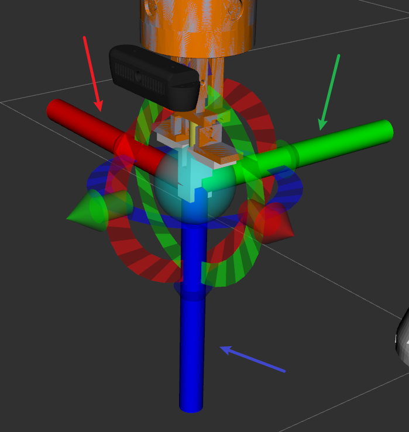

图 07：RViz 中红、绿、蓝分别表示 X、Y、Z 轴；按右手定则理解正旋转方向。

### 质量要求

- 机器人到位后等待 1.0 s，并要求 0.30 s 关节静止窗口。
- 视觉必须连续 10 帧检测成功；每帧检查 ArUco 距离、边距和像素边长，窗口检查中心、深度和旋转向量稳定性。
- 用 10 帧角点中位数重新计算 IPPE 方码位姿，0.15 s 后读取 `base_T_ee`。
- 至少接受 15 个样本，解算和离群值剔除后至少保留 14 个；相邻样本至少相差 6 mm 或 3°，总体至少覆盖 40 mm 和 20°。
- Park 与 Horaud 是硬共识算法；Tsai-Lenz 只输出诊断。随后执行固定标定板优化和最多一次残差剔除。

仿真会冻结 `tool0 -> camera_color_optical_frame` 真值：总平移误差不超过 3 mm、单轴误差不超过 2 mm、旋转误差不超过 1° 时才保存 `.calib`。实机没有真值门，但仍会检查算法一致性、残差和外参安装合理性。

## 3. 共用前置条件

1. 构建并加载 ROS 2 Humble 与工作区：

   ~~~bash
   source /opt/ros/humble/setup.bash
   source $HOME/my-workspace/fairino_robotarm/install/setup.bash
   ~~~

2. 确认图像、`CameraInfo`、ArUco 字典和实际码边长一致；标定码清晰、无强反光且初始姿态位于画面中央。
3. 确认在图像时间戳可查询完整 TF 链；仿真使用 `use_sim_time:=true`，实机使用 `use_sim_time:=false`。
4. 每次实验使用独立、可追溯的保存目录；不得覆盖已有 `.samples` 或 `.calib`。

## 4. 自动 Eye-in-Hand 标定

### 4.1 行为与配置

自动采集器使用 20 槽固定关节表。每个非 `TODO` 路点只执行一次正式 MoveIt `plan + execute`，不使用 Look-at、预规划、失败回退或自动候选路点。

第 1 槽是唯一初始姿态。Enter 或 `s` 开始采集并在每个路点前确认；完成、失败或样本不足后，只有 `h+Enter` 会返回第 1 槽。`q+Enter` 或 Ctrl+C 取消并保持当前位置；也可以调用 `/auto_calibration_collector/start` 服务。

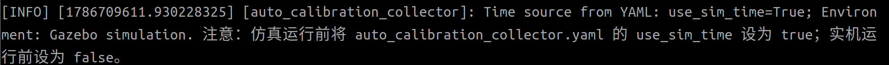

图 01：自动采集的终端状态与交互提示；开始前确认环境、时间源和保存目录。

直接运行采集器时，`auto_calibration_collector_params.yaml` 是时间源、真值检查和输出目录的默认来源。切换环境后先修改该文件并重启采集器；不要同时使用 `--ros-args -p use_sim_time` 覆盖它。

| 配置项 | Gazebo 仿真 | 真实机械臂 |
| --- | --- | --- |
| `runtime.use_sim_time` | `true` | `false` |
| `solver_validation.ground_truth_check_enabled` | `true` | `false` |
| `output.calibration_output_directory` | `.../calib/sim` | `.../calib/real` |

固定关节路点、速度、加速度、视觉质量门和求解门限也位于该 YAML。修改路点前，必须先在仿真或示教器中验证全部非 `TODO` 路点可达、无碰撞且标定码持续可见。

### 4.2 仿真

终端 1：

~~~bash
ros2 launch myrobot_simulation calibration_sim.launch.py \
  robot_profile:=fairino_arm_gripper_inhand
~~~

终端 2：完成仿真 YAML 配置后启动采集器。

~~~bash
ros2 run hand_eye_calibration auto_calibration_collector.py
~~~

将标定码放在相机画面中央，并确认其位于可检测距离范围内。初始位置可参考机械臂基座正 Y 方向约 0.38 m；实际以当前相机视野和仿真模型为准。

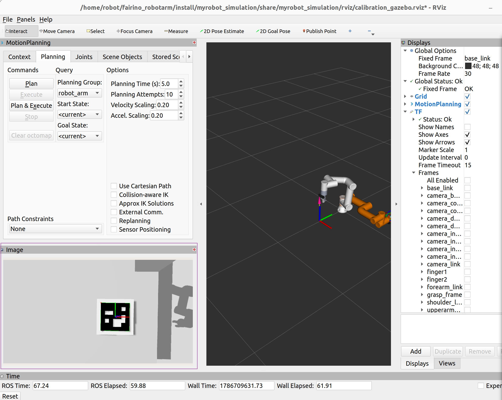

图 02：自动 Eye-in-Hand 采集前，标定码应在画面中央且边缘完整可见。

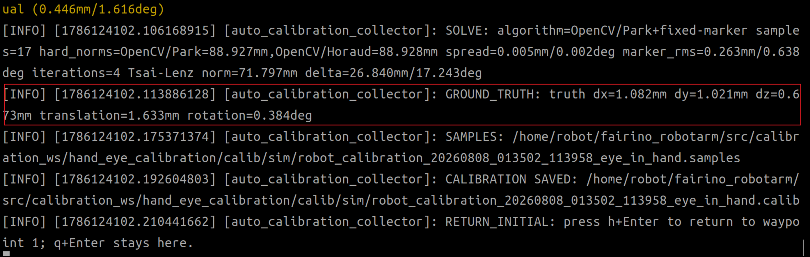

图 03：自动 Eye-in-Hand 仿真结果示例；仅真值门和求解质量门均通过时才会保存 `.calib`。

### 4.3 实机

终端 1：

~~~bash
ros2 launch hand_eye_calibration calibrate.launch.py \
  calibration_type:=eye_in_hand use_sim_time:=false
~~~

终端 2：将 YAML 切换为实机配置后启动采集器。

~~~bash
ros2 run hand_eye_calibration auto_calibration_collector.py
~~~

实机开始前，先用低速确认第 1 槽和后续固定路点可达；采集期间不要移动标定板、相机支架或工具法兰。中断后，不要将不完整的 `.samples` 当作正式结果。

## 5. 半自动流程：共用操作

半自动流程使用 `assisted_calibration.launch.py` 启动 Easy Handeye2 和 `manual_calibration_assistant.py`。环境、相机、ArUco 与 MoveIt 必须在另一个终端先启动；该入口不会重复启动它们。

启动前检查 `manual_calibration_assistant_params.yaml`：仿真设置 `runtime.use_sim_time: true` 与 `solver_validation.ground_truth_check_enabled: true`，实机均设为 `false`。`calibration_output_directory` 指向对应的 `calib/sim` 或 `calib/real`。

1. 在初始安全姿态确认标定码清晰、居中后点击 **Take Sample**，记录 root 样本。
2. 按终端和 RViz 的轴向/角度引导移动机械臂；停稳且标定码重新居中后再次点击 **Take Sample**。
3. 若当前样本不合格，点击 **Remove Sample** 删除 GUI 中最新样本，修正视野或姿态后重新采集。
4. 完成约 20 个合格样本后点击 **Save**。保存前仍必须通过不少于 15 个有效样本及全部质量门。

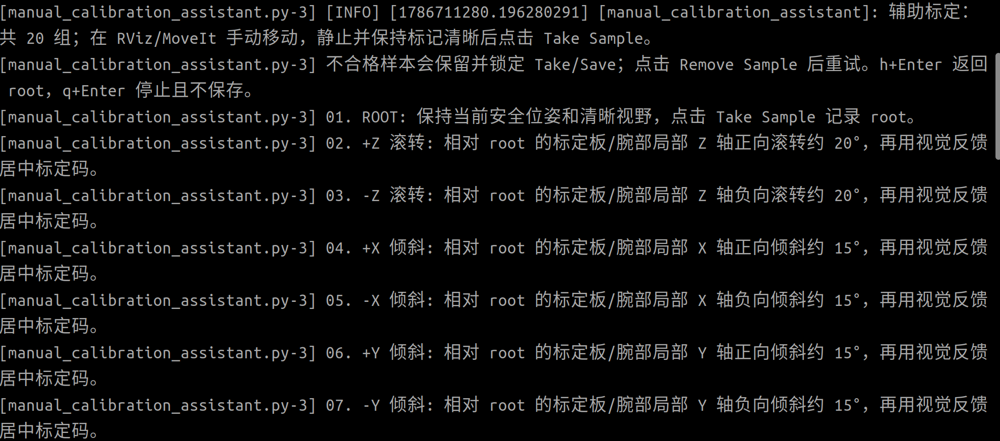

图 05：半自动助手显示采样序号、建议旋转方向和视觉就绪状态。

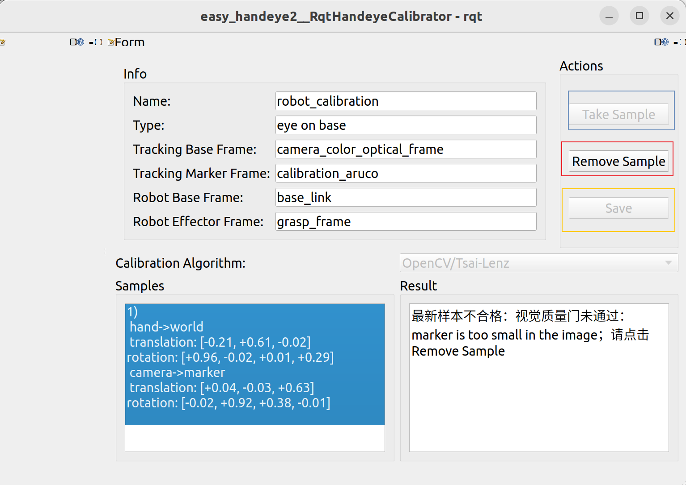

图 06：在 GUI 中使用 Take Sample、Remove Sample 和 Save 完成半自动标定会话。

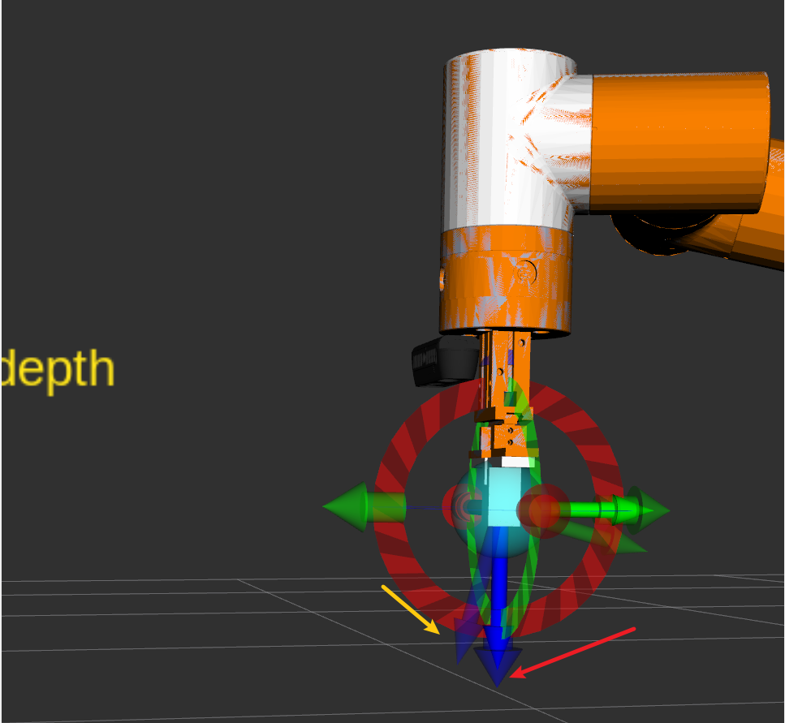

图 08：根据 RViz 实线坐标轴和目标虚影调整旋转；旋转后应再次通过平移使标定码居中。

常见不合格原因包括：标定码距离过远、在画面中占比过小、接近图像边缘、旋转后未重新居中、机器人尚未静止或样本姿态与已有样本过于相似。不要为凑数量而接受不合格样本。

## 6. 半自动 Eye-on-Base

### 6.1 仿真

终端 1：

~~~bash
ros2 launch myrobot_simulation calibration_sim.launch.py \
  robot_profile:=fairino_arm_gripper_calibration_onbase
~~~

终端 2：

~~~bash
ros2 launch hand_eye_calibration assisted_calibration.launch.py \
  calibration_type:=eye_on_base \
  use_sim_time:=true \
  storage_directory:=$HOME/my-workspace/fairino_robotarm/src/calibration_ws/hand_eye_calibration/calib/sim
~~~

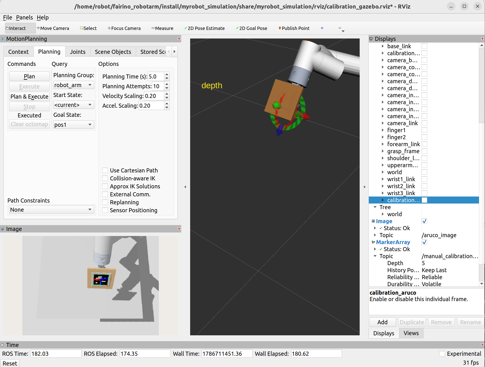

图 04：Eye-on-Base 初始采样时，固定相机应完整看到安装在末端的标定码。

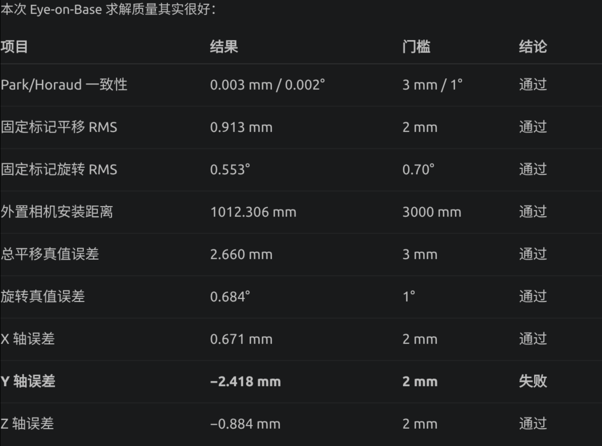

图 09：Eye-on-Base 仿真结果示例；应结合真值、算法一致性和残差判断，而非只查看单一数值。

### 6.2 实机

终端 1：

~~~bash
ros2 launch hand_eye_calibration calibrate.launch.py \
  calibration_type:=eye_on_base use_sim_time:=false
~~~

终端 2：

~~~bash
ros2 launch hand_eye_calibration assisted_calibration.launch.py \
  calibration_type:=eye_on_base \
  use_sim_time:=false \
  storage_directory:=$HOME/my-workspace/fairino_robotarm/src/calibration_ws/hand_eye_calibration/calib/real
~~~

外置相机标定时，确认相机支架相对基座完全固定；任何支架移动都要求重新标定。

## 7. 半自动 Eye-in-Hand

### 7.1 仿真

终端 1：

~~~bash
ros2 launch myrobot_simulation calibration_sim.launch.py \
  robot_profile:=fairino_arm_gripper_inhand
~~~

终端 2：

~~~bash
ros2 launch hand_eye_calibration assisted_calibration.launch.py \
  calibration_type:=eye_in_hand \
  use_sim_time:=true \
  storage_directory:=$HOME/my-workspace/fairino_robotarm/src/calibration_ws/hand_eye_calibration/calib/sim
~~~

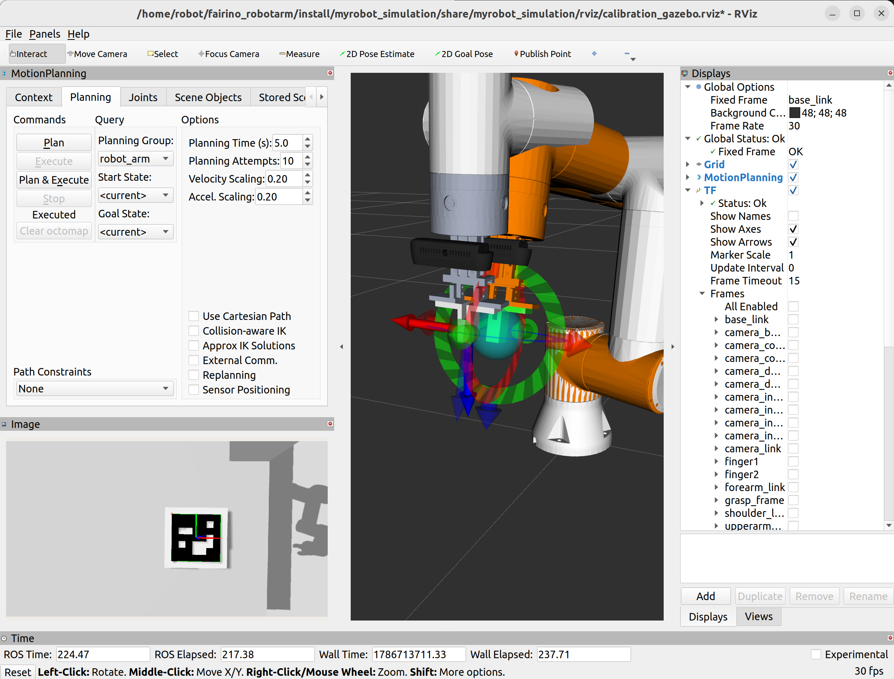

图 10：半自动 Eye-in-Hand 的 root 采样前，标定码应清晰、完整并位于画面中央。

当围绕某轴旋转后，标定码通常会偏离画面中心。保持目标旋转量的同时，沿合适的 X/Y 方向平移末端，使其重新居中再采样。

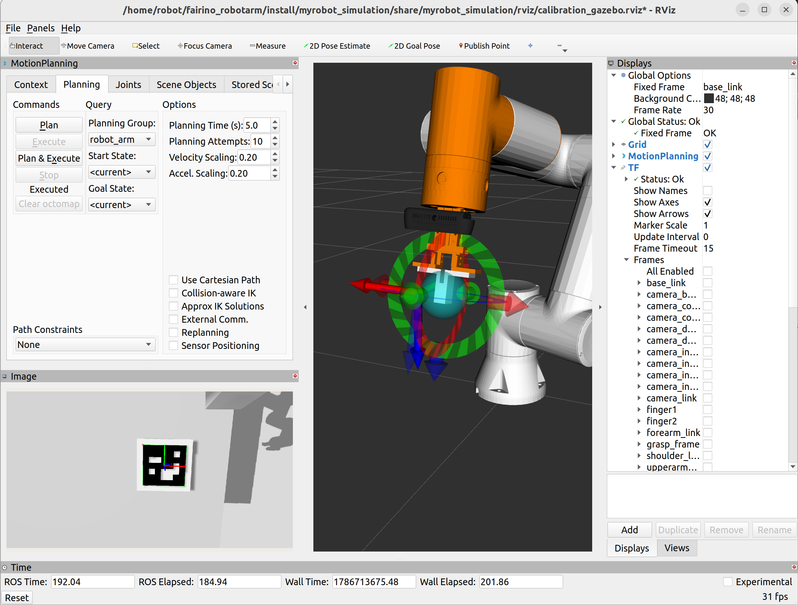

图 11：旋转后通过平移补偿恢复标定码居中，避免因视野偏移导致样本被拒绝。

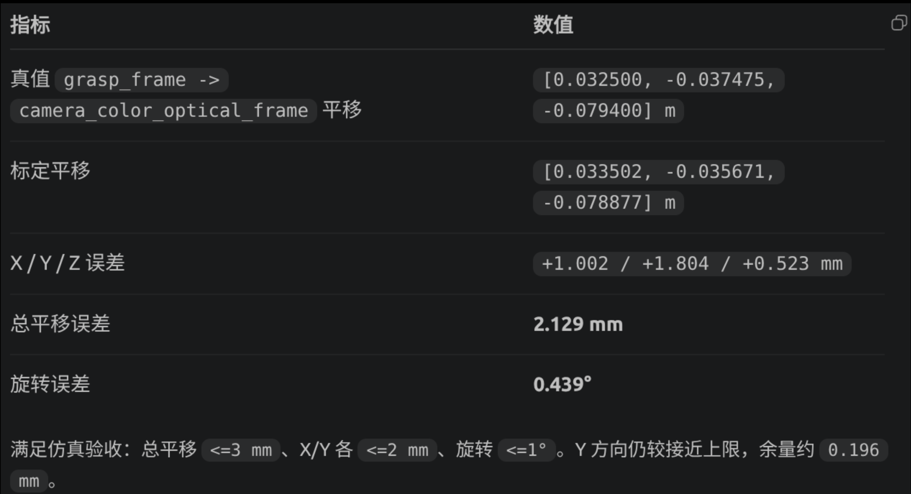

图 12：半自动 Eye-in-Hand 仿真结果示例；真值通过只说明该次仿真配置符合门限，不替代实机验证。

### 7.2 实机

终端 1：

~~~bash
ros2 launch hand_eye_calibration calibrate.launch.py \
  calibration_type:=eye_in_hand use_sim_time:=false
~~~

终端 2：

~~~bash
ros2 launch hand_eye_calibration assisted_calibration.launch.py \
  calibration_type:=eye_in_hand \
  use_sim_time:=false \
  storage_directory:=$HOME/my-workspace/fairino_robotarm/src/calibration_ws/hand_eye_calibration/calib/real
~~~

实机操作步骤与仿真一致，但没有 Gazebo 真值可作为最终判断。应保存 `.samples`、核对求解器一致性和残差，并在独立的抓取或定位任务中做受控验证。

## 8. 结果验收与问题排查

| 现象 | 优先检查项 |
| --- | --- |
| 采集器没有开始 | 使用 Enter/`s` 或调用 `/auto_calibration_collector/start`；确认终端为可交互 TTY。 |
| 标记持续不合格 | 检查距离、画面边距、像素边长、反光、模糊、`CameraInfo`、码尺寸和字典。 |
| 样本覆盖不足 | 增加多轴旋转及横向/深度变化；不要只重复同一姿态。 |
| 仿真真值门失败 | 核对 `use_sim_time`、标定类型、相机/末端 frame、TF 方向和仿真 profile。 |
| 实机结果不稳定 | 检查相机/标定板是否松动、相机时间与 TF 新鲜度、工具偏移和实际码边长。 |
| 无法保存 | 检查有效样本数、Park/Horaud 一致性、残差与输出目录权限；查看 `.samples` 中的诊断数据。 |

`.samples` 保存采样与诊断信息，`.calib` 是通过验收后可发布的标定结果。不要将未通过验收的文件用于下游抓取、视觉伺服或运动规划。
